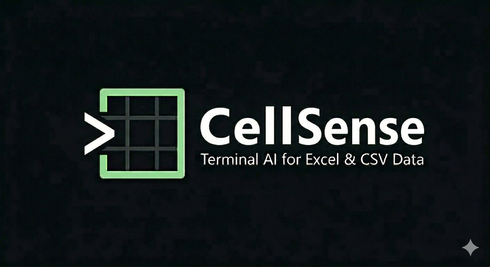

<p align="center">
  
</p>

<p align="center">
  Ask your CSV and Excel files questions in plain English, from your terminal.
</p>

CellSense is a [LangGraph](https://github.com/langchain-ai/langgraph) agent harness for
tabular data: it plans a question, calls typed pandas tools against your live DataFrames,
and answers with row-level citations you can go check yourself. Five providers, one CLI.

## What it looks like

```
$ cellsense data/sales_2024.csv -q "What is the total revenue by region?"

Total revenue by region

| Region          | Total Revenue |
|-----------------|---------------|
| APAC            |    453,389.64 |
| EMEA            |    512,608.70 |
| LATAM           |    227,293.50 |
| North America   |  1,032,503.30 |

Sources: sales_2024.csv [240 rows]
```

Verbatim output from a real run on Groq against the sample data below; the four
figures match `pandas` exactly. Note the citation says `240 rows` rather than
listing indices — every row of the file contributed to those sums, and saying so
is more honest than printing the first fifty.

In the REPL the same turn streams a live tool trace above the answer as it happens:

```
⏺ describe(filename="sales_2024.csv")
  ⎿ 10 columns · 0.0s
⏺ aggregate(group_by=['region'], aggregations={'revenue': 'sum'})
  ⎿ 4 groups · 0.1s
```

## Install

```bash
python3.11 -m venv ~/.venvs/cellsense   # keep it OUTSIDE this repo -- see docs/DEVELOPMENT.md
source ~/.venvs/cellsense/bin/activate

pip install -e '.[all,dev]'             # editable install, every provider extra, dev tooling
cp .env.example .env                    # then fill in at least one API key
```

`.[all,dev]` pulls in every provider's LangChain integration package plus the dev
toolchain (pytest, ruff, mypy). Providers are also installable individually if you only
need one, e.g. `pip install -e '.[groq]'` -- see the extras in `pyproject.toml`.

## Quickstart

```bash
python scripts/make_sample_data.py      # writes data/sales_2024.csv, headcount.csv, products.xlsx

cellsense data/sales_2024.csv -q "total revenue by region?"
cellsense data/sales_2024.csv data/headcount.csv         # interactive REPL, both files loaded
```

In the REPL, ask questions in plain English; `@` mid-question fuzzy-attaches another file,
and `/help` lists the slash commands. See `docs/USAGE.md` for the full command/flag
reference.

## Features

- **LangGraph orchestration** -- a guardrail rejects off-topic questions before any tool
  runs; a planner decomposes a question into independent sub-tasks that fan out across
  parallel workers and get synthesized back into one answer (a single sub-task skips the
  fan-out entirely, for latency).
- **7 tools** over live DataFrames: `aggregate`, `filter_rows`, `join`, `describe`, `plot`,
  `list_directory`, `find_files`.
- **Row-level citations** -- every answer ends with a `Sources:` block pointing at the
  actual source row indices (not the reshaped output's), so you can go verify it.
- **Streaming + a live tool trace** -- the REPL shows a spinner with elapsed time, running
  token count and cost, and prints each tool call and its result as it happens.
- **Session persistence + resume** -- every turn is checkpointed to SQLite
  (`~/.cellsense/sessions.db`); `cellsense sessions` lists saved threads, `--resume <id>`
  or `/resume` continues one.
- **Approval gates** -- side-effecting tools (currently just `plot`, which writes a PNG)
  pause for an allow / allow-always / deny prompt unless `--yes`/`--deny` (or
  `permissions.mode` in config) says otherwise.
- **Cost tracking** -- per-turn and per-session token/cost totals, shown live and via
  `/cost`; unpriced models show `-` rather than a misleading `$0.00`.
- **5 providers**, swappable per-invocation or mid-session with `--model`/`/model`.

## Providers

| Provider | Default model | Env var | Status on this machine |
| --- | --- | --- | --- |
| **Groq** | `openai/gpt-oss-120b` | `GROQ_API_KEY` | confirmed working end-to-end |
| **Google Gemini** | `gemini-2.5-flash` | `GEMINI_API_KEY` | confirmed working end-to-end |
| **Anthropic** | `claude-sonnet-5` | `ANTHROPIC_API_KEY` | implemented, unverified here -- no key available |
| **OpenAI** | `gpt-4o` | `OPENAI_API_KEY` | implemented, unverified here -- no key available |
| **Llama** (bring-your-own host) | `Llama-3.3-70B-Instruct` | `LLAMA_API_KEY` + `LLAMA_BASE_URL` | implemented, unverified here -- no third-party host configured |

Meta retired its first-party hosted Llama API on 2026-07-06, so the `llama` provider now
targets **any OpenAI-compatible Llama host** you point it at (Together AI, AWS Bedrock,
Fireworks, a self-hosted vLLM/TGI server) via `LLAMA_BASE_URL` -- there is no default
endpoint anymore, and pricing is host-specific so it's shown as `-`.

Run `cellsense models` for the full curated table (context window, per-million-token
pricing, and whether each provider's key is currently set), and `cellsense doctor` to
check your local setup. Model ids in that table are metadata, not a whitelist --
`--model groq:some-new-id` still works even if it's not listed.

## Configuration

Settings resolve as **CLI flag > environment variable > `./.cellsense/config.toml` >
`~/.cellsense/config.toml` > built-in default**. `cellsense init` writes a starter file:

```toml
[model]
default = "groq:openai/gpt-oss-120b"
temperature = 0.0

[agent]
max_tool_rounds = 8
planner = true

[permissions]
mode = "prompt"          # "prompt" | "allow" | "deny"
allow = ["aggregate", "filter_rows", "join", "describe"]
```

Every key, its type/default, and the full precedence chain are documented in
`docs/CONFIGURATION.md`.

## Architecture

```
cli.py -> ui -> events <- graph -> providers
                  ^          |
                  |          v
              observability  tools -> io
```

`cellsense/graph/engine.py`'s `Engine` is the one seam the CLI and the UI both code
against: `Engine.stream_turn()` yields a stream of typed events (plan created, tool
started/finished, approval requested, usage updated, ...) and always terminates in
exactly one `TurnFinished` or `TurnFailed`. See `docs/ARCHITECTURE.md` for the full
module layout, the event protocol, and the turn lifecycle diagram.

## Contributing / development

`TODO.md` tracks known limitations, test gaps, and planned work -- start there if
you want to pick something up.

See `docs/DEVELOPMENT.md` -- environment setup (including a real iCloud/`dataless`-file
trap this repo hit and how to diagnose it), lint/type/test commands, and how to add a
tool or a provider.
